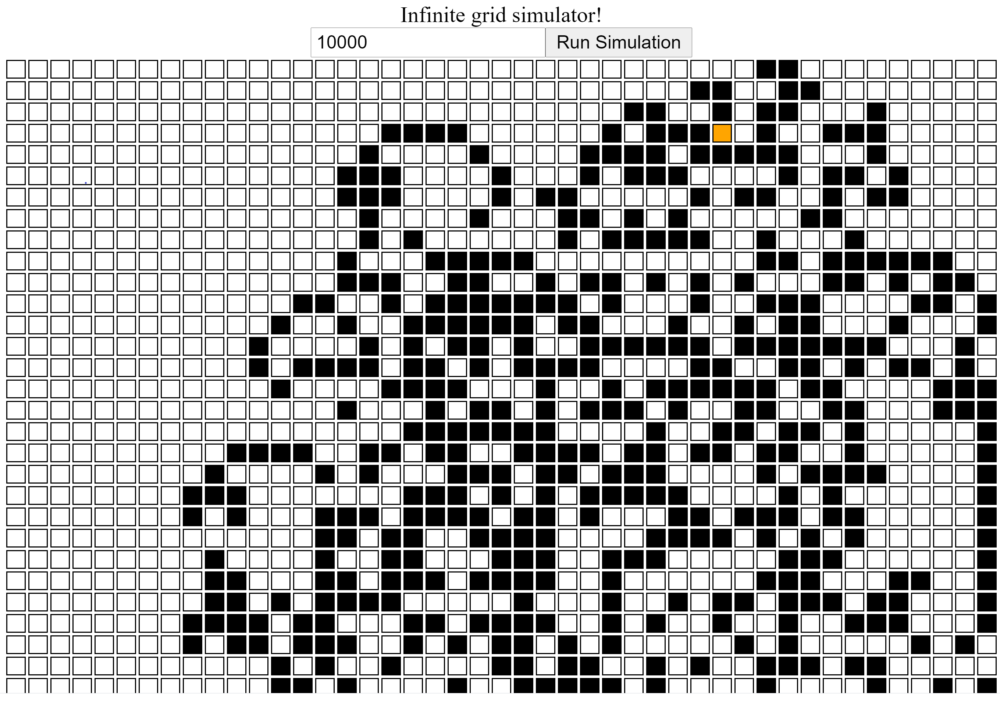

# Infinite grid simulator

Consider an infinite grid of white and black squares. The grid is
initially all white and there is a machine in one cell facing right. It
will move based on the following rules:

- If the machine is in a white square, turn 90° clockwise and move
forward 1 unit;
- If the machine is in a black square, turn 90° counter-clockwise
and move forward 1 unit;
- At every move flip the color of the base square.

Implement an application that will receive HTTP PUT requests with a
number of steps the simulation should run, always starting from the same
conditions, and output the resulting grid to a file.
Please provide support documentation 

## How to run 

Use maven to run on paraya microserver. Type in a Terminal from the project root directory:

```bash
mvn clean package payara-micro:start
```
The server home page can found be at:
```bash
http://localhost:8080/gomSpaceTest-1.0-SNAPSHOT/index.xhtml
```

## Rest Endpoint Location

```bash
http://localhost:8080/gomSpaceTest-1.0-SNAPSHOT/ap/v1/simulate/steps
```

## Usage

The put  Accepts JSON  request is in the form:

```
{
"steps": <number of simulation steps>, 
"responseType": <"Array" or "String">
}
```
And the response will be in JSON in the form

```
{
"response": <array or a String,wherelines are separated by \n>, 
"errMsg": <error message from server e.g. out of memory>
}
```


## Front End Graphical Interface

A graphical interface allows the user to interact with the endpoints. 



## Tests

For the tests is used the [Arquilian](https://arquillian.org/)  Testing platform


Classes that are tested:

```
ActorMachine, Grid, Simulator
```

## Todo

- docker packaging
- improvement of gui
